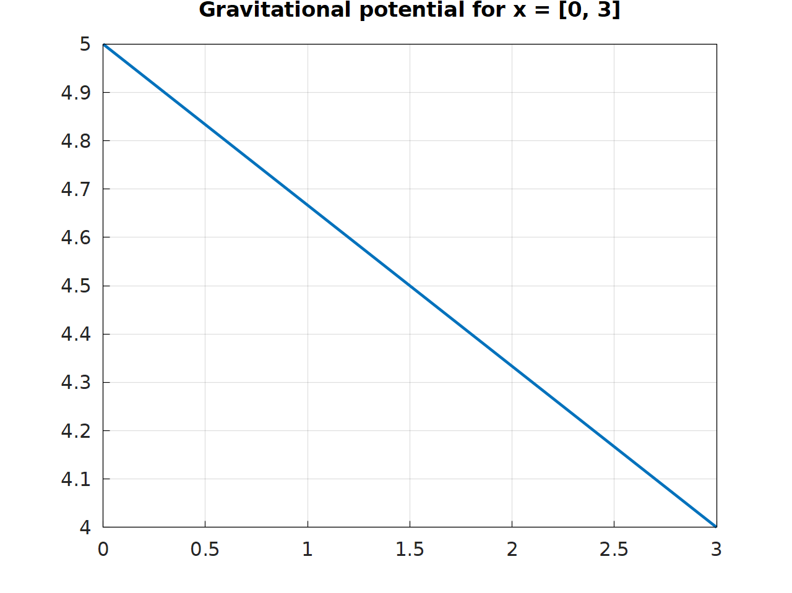

# Gravitational potential
### Differential and difference equations course project of finite element method

#### Prerequisites
- [Eigen](https://eigen.tuxfamily.org)
- [gnuplot](http://www.gnuplot.info/download.html)
- [matplot++](https://alandefreitas.github.io/matplotplusplus)

#### How to run on Windows
Open the terminal in `release` directory after building, then type:
```
.\solver.exe N
```

#### Example plot for N = 1024
